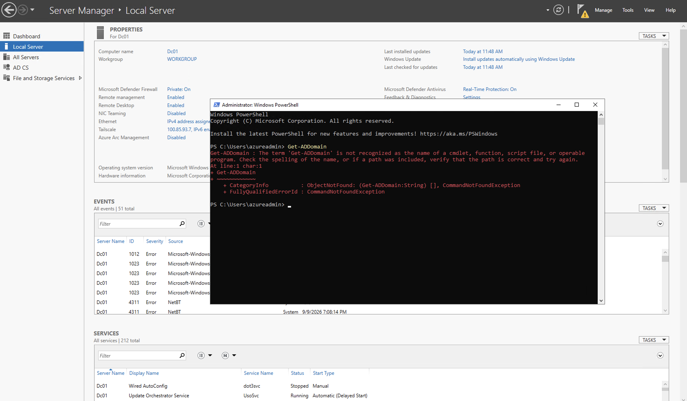
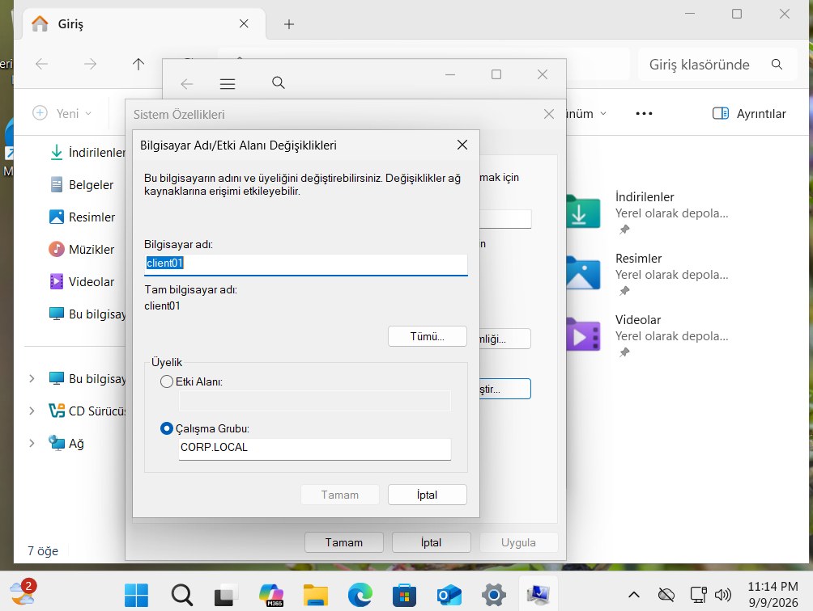
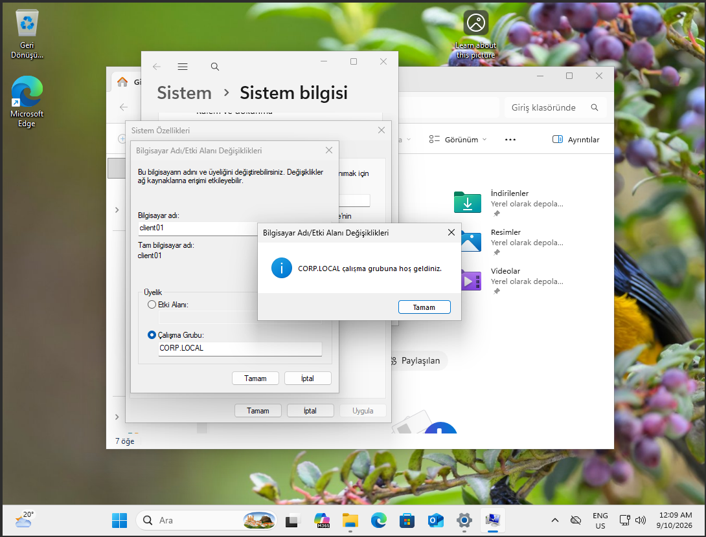
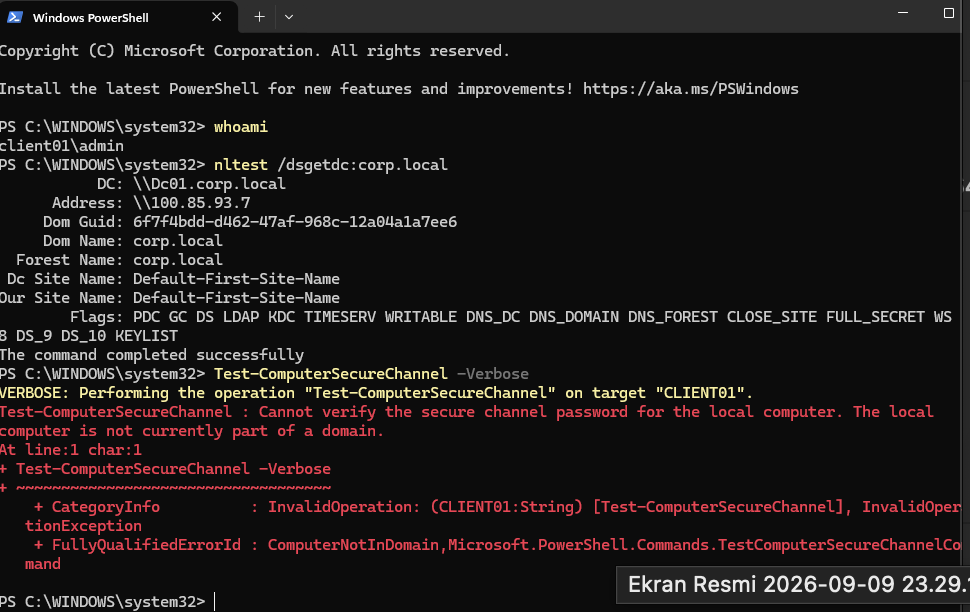
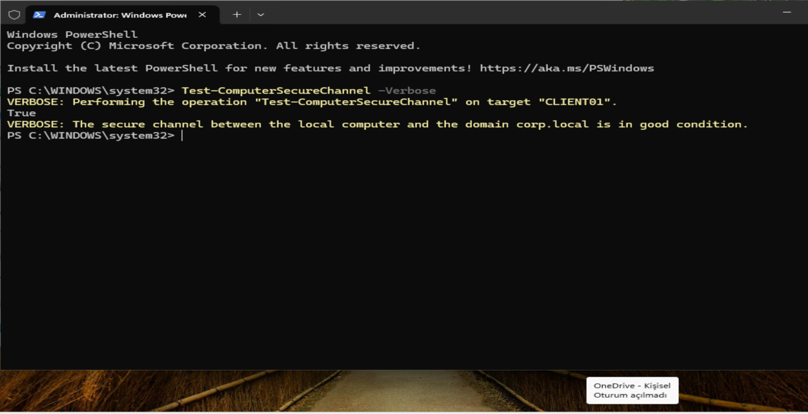
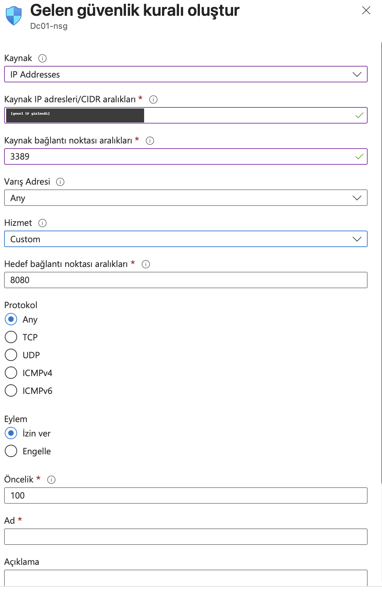
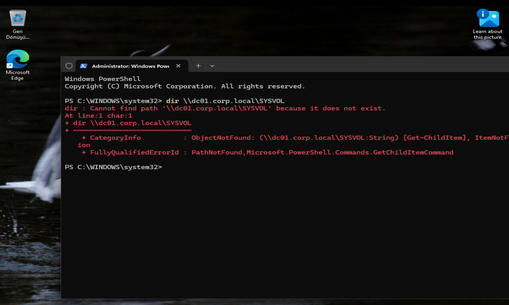

# Karşılaştığım Hatalar

Bu lab'ı kurarken her şey ilk seferde düzgün gitmedi — aşağıda karşılaştığım gerçek sorunları, neden olduklarını ve nasıl çözdüğümü sırayla anlatıyorum. Bilgi eksikliğinden kaynaklanan hataları da çıkarmadım, çünkü bir sorunu doğru teşhis edip çözmek, hiç hata yapmamış gibi görünmekten daha çok şey gösteriyor bence.

---

### 1. Windows Server ISO'su Apple Silicon'da hiç açılmadı

DC01'i baştan yerelde, VirtualBox içinde kurmayı planlamıştım. Windows Server 2022 Evaluation ISO'sunu indirdim, VM'i oluşturdum, boot etmeye çalıştım — hiçbir şekilde açılmadı.

Sebebini araştırınca öğrendim ki Mac M4 (Apple Silicon / ARM64) üzerinde VirtualBox sadece native ARM64 misafir işletim sistemi çalıştırabiliyor, x86-64 emülasyonu yok (Oracle bunu performans gerekçesiyle bilinçli olarak koymamış). Windows Server'ın da resmi bir ARM64 ISO'su yok, sadece kararsız Insider build'leri var. Yani elimdeki ISO baştan bu donanımda çalışamazdı.

Çözüm olarak işi ikiye böldüm: CLIENT01 (Windows 11) yerelde ARM64 ISO ile VirtualBox'ta kaldı, DC01 (Windows Server 2022) ise Azure'a taşındı — orada x86-64 native olarak çalışıyor. Çıkardığım ders: "Windows Server kur" demek her donanımda aynı adımlar anlamına gelmiyor, önce mimariye bakmak lazım.

### 2. Azure'da B serisi VM boyutu hiç görünmedi

Azure'da DC01 için VM oluştururken önerilen B2s boyutunu (2 vCPU / 4GB, burstable) arıyordum ama boyut seçicide sadece L Serisi gibi tamamen alakasız, depolama odaklı aileler çıkıyordu.

Bir süre uğraştıktan sonra fark ettim ki free trial abonelikleri bazı bölgelerde B serisine kota=0 koyuyor, ve free trial hesapları kota artırma talebi de yapamıyor. Arayüzde bu açıkça belirtilmiyor, sadece o aile listeden kayboluyor. D Serisi v6'dan D2s_v6'ya geçtim, sorun çözüldü.

### 3. AD DS yerine yanlışlıkla AD CS kurdum

Server Manager'da "Add Roles and Features" ile Active Directory rolünü kurmaya çalışırken, sarı bayrağa tıkladığımda karşıma "Active Directory Certificate Services" (AD CS) kurulumu çıktı — domain controller'a yükseltme seçeneği hiç gelmedi. Server Manager hâlâ "Workgroup: WORKGROUP" gösteriyordu.

Meğer rol listesinde "Active Directory Certificate Services" ile "Active Directory Domain Services" yan yana duruyor ve isimleri tek harf (CS/DS) dışında neredeyse aynı. Yanlış olanı işaretlemişim. (Yanlış rolün ekran görüntüsü aşağıda 7. maddede — sol menüdeki "AD CS" satırı.) AD CS'i kaldırıp doğru rolü (AD DS) kurunca "promote to domain controller" seçeneği bu sefer doğru çıktı. Artık rol/özellik kutucuklarını işaretlemeden önce açıklama satırını okuyorum.

### 4. "Google'a bağlanamıyorum" — DNS çalışmadı

CLIENT01'in DNS ayarını DC01'in Tailscale IP'sine yönlendirmiştim, ama bu AD DS kurulmadan önceydi — sıralamayı yanlış yapmışım. Sonuç: CLIENT01 hiçbir siteye bağlanamıyordu, google.com dahil.

Aslında ortada çözülecek bir hata yoktu, sıralama sorunuydu. DC01'de DNS Server rolü henüz çalışmıyordu çünkü AD DS kurulmamıştı. AD DS kurulup DC01 domain controller'a yükseltilince DNS rolü otomatik geldi ve hem iç hem dış isim çözümü kendiliğinden düzeldi. Panikleyip geri almak yerine sıradaki adımı tamamlamak yeterliymiş.

### 5. RDP, Tailscale üzerinden 0x204 hatası verdi

Azure NSG'den public RDP kuralını kaldırdıktan sonra (planlanan güvenlik adımıydı) artık DC01'e sadece Tailscale IP'si üzerinden bağlanmaya çalışıyordum. Windows App sürekli "We couldn't connect to the remote PC... Error code: 0x204" veriyordu.

İlk aklıma gelen: Tailscale yeni bir sanal ağ arayüzü oluşturuyor, Windows tanımadığı ağları genelde "Public" profil sayıyor, RDP kuralı da genelde sadece Domain/Private'ta açık — o yüzden engelleniyor olabilir dedim. Azure Run Command ile firewall kuralını tüm profillerde açtım. İşe yaramadı, aynı hata devam etti.

Asıl sebebi `Get-Service Tailscale` ile `tailscale status` çıktısını karşılaştırınca buldum: servis "Running" görünüyordu ama Tailscale'in kendisi "Logged out" diyordu. Yani Windows servisi ayaktaydı ama DC01 aslında tailnet'ten düşmüştü, IP'si hiç aktif değildi — firewall'la ilgisi yokmuş. `tailscale up` ile yeniden kimlik doğrulayınca düzeldi. Buradan çıkardığım ders: "servis çalışıyor" ile "servise giriş yapılmış" farklı şeyler, `Get-Service` sadece Windows seviyesini gösteriyor.

### 6. Tailscale DC01'de üç kez daha "Logged out" oldu

Bir önceki sorunu çözdükten sonra bağlantı bir süre iyiydi, sonra DC01'in Tailscale oturumu art arda üç kez kendiliğinden düştü. Denediğim ve işe yaramayanlar: tekrar `tailscale up` ile giriş (geçici çalıştı, tekrar düştü), sistem saatini kontrol etmek (saat sorunsuzdu), reusable auth key ile giriş (bu bile kalıcı olmadı).

Sonunda Tailscale'i tamamen kaldırıp GUI üzerinden sıfırdan kurdum, bu sefer "Run unattended" modunu da açtım. Bu üçüncü tekrarı kapattı. Kesin kanıtlayamadım ama en makul açıklama şu: DC01'in workgroup'tan domain controller'a geçişi Windows'un yerel kimlik/şifreleme bağlamını (DPAPI) değiştiriyor, bu da Tailscale'in sakladığı oturum bilgisini bozmuş olabilir. Bazen kök nedeni tam bulmak yerine "kaldır, baştan kur" gibi kaba ama etkili bir çözüme geçmek daha mantıklı.

### 7. Notlarımda "tamamlandı" yazıyordu ama gerçekte tamamlanmamıştı

Bu benim için en öğretici olanı. Projeyi yürütürken hem teknik konularda destek aldığım hem de kritik bilgileri (IP'ler, şifreler, hangi adımda kaldığım) unutmamak için not tuttuğum bir yapay zekâ asistanı kullanıyordum. Günler süren Tailscale/RDP krizinden sonra "artık sıradaki adıma geçelim" dediğimde, bu asistanın tuttuğu notlarda "AD DS kuruldu, DC01 domain controller" yazıyordu.

Gerçekte AD DS hiç kurulmamıştı — Server Manager'da hâlâ yanlış rol (AD CS) duruyordu, DC01 hâlâ WORKGROUP'taydı, `Get-ADDomain` komutu bile tanınmıyordu.

Tek karede üç kanıt var: sol menüde AD DS değil **AD CS** yazıyor, üstte **Workgroup: WORKGROUP** görünüyor (yani domain controller değil) ve PowerShell `Get-ADDomain` komutunu tanımıyor — çünkü o komut AD DS ile birlikte gelir, kurulmadıysa yoktur.

Kontrol edince anladım ki asistan, "reboot sonrası içeri giremiyoruz" cümlesinden kendi kendine "demek ki promote işlemi tamamlanmış olmalı" diye bir çıkarım yapmış ve bunu doğrulamadan notlara "tamamlandı" diye yazmış. Günler süren kriz dikkatimizi asıl işten (AD DS kurulumu) tamamen uzaklaştırdığı için ben de bunu ekrandan teyit etmemiştim, notlara güvenmiştim.

Server Manager ekran görüntüsü ve `Get-ADDomain` komutuyla gerçek durumu kontrol edince yanlışı yakaladım, notu düzelttim ve kuruluma sıfırdan (AD CS'i kaldır → AD DS'i kur → promote et) başladım. Çıkardığım ders basit: bir sistemin (asistan olsun, kendi not dosyam olsun) "tamamlandı" demesi, gerçekten tamamlanmış olduğu anlamına gelmiyor. Uzun ve yorucu bir sorun giderme sürecinden çıkınca notlara değil, ekrandaki gerçek duruma bakmak gerekiyor.

### 8. "corp.local"a katılmaya çalışırken aslında bir Workgroup oluşturdum

CLIENT01'i domain'e katarken "Computer Name/Domain Changes" penceresine `corp.local` yazıp onayladım ama kimlik doğrulama ekranı hiç gelmedi, bunun yerine "CORP.LOCAL çalışma grubuna hoş geldiniz" mesajı çıktı.

Pencerede iki radyo düğmesi var: "Etki Alanı" ve "Çalışma Grubu". Ben farkında olmadan "Çalışma Grubu" seçiliyken `corp.local` yazmışım, sistem de bunu yeni bir workgroup adı olarak yorumlamış:

Workgroup'larda merkezi kimlik doğrulama olmadığı için kimlik istemeden direkt "hoş geldin" dedi — beklediğim kimlik doğrulama ekranının hiç gelmemesinin sebebi buydu:

İşin sinsi tarafı, yüzeysel kontroller "her şey yolunda" diyordu. `nltest /dsgetdc:corp.local` çalıştırdığımda DC01'i buluyor, IP'sini, forest adını, flag'lerini döndürüyordu — yani ağ yolu tamamdı. Ama `Test-ComputerSecureChannel` çalıştırınca gerçek ortaya çıktı: *"the local computer is not currently part of a domain."*

Bu ikisi arasındaki fark önemli: `nltest` **domain controller'a ulaşabiliyor muyum** sorusunu cevaplıyor, `Test-ComputerSecureChannel` ise **bu bilgisayarla domain arasında gerçek bir güven ilişkisi var mı** sorusunu. Birincisi yeşil yanarken ikincisi kırmızı yanabiliyor.

"Etki Alanı" düğmesini seçip aynı adı tekrar yazınca kimlik doğrulama ekranı doğru çıktı. Bu sefer sadece arayüzdeki "hoş geldin" mesajına güvenmek yerine `Test-ComputerSecureChannel -Verbose` çalıştırdım, çıktı `True` geldi — yani CLIENT01 ile DC01 arasındaki güven ilişkisi gerçekten kurulmuş, kriptografik seviyede doğrulanmış:

Bu da bir önceki hatayla aynı aileden: sistem "başarılı" dedi ama yaptığı şey istediğim şey değildi. Farkı, bu sefer hatanın kaynağının benim yanlış varsayımım değil, arayüzün kendisi olması — iki farklı işlevin (domain'e katılma / workgroup değiştirme) aynı pencerede, aynı metin kutusunu paylaşan iki radyo düğmesiyle sunulması gerçekten kafa karıştırıcı. "Hoş geldin" mesajı görmek, doğru şeyi yaptığımın kanıtı değilmiş — sadece bir şeyin olduğunun kanıtıymış.

### 9. Azure NSG kuralını neredeyse tamamen yanlış alanlarla doldurdum

*(Bu, sıra olarak 6. maddeyi çözerken yaşandı — Tailscale'i GUI'den kurabilmek için geçici bir RDP kuralı açmam gerekiyordu.)*

Azure'da kendi IP'me özel, geçici bir RDP kuralı oluşturuyordum. Formu doldurdum, kaydetmeye çalıştım, olmadı. Baktığımda dört ayrı alanı yanlış doldurduğumu gördüm:

- **Kaynak bağlantı noktası aralıkları: 3389.** Buraya 3389 yazmak, "sadece kendi bilgisayarımdaki 3389 numaralı porttan gelen trafiği kabul et" demek. Ama RDP'de 3389 hedef taraftaki port; istemci tarafı rastgele bir port kullanır. Doğrusu `*`.
- **Hizmet: Custom + hedef port 8080.** RDP hazır şablonu dururken elle Custom seçip 8080 yazmışım — 8080 tamamen alakasız bir port (genelde web proxy). Doğrusu: Hizmet listesinden **RDP** seçmek, o zaman 3389/TCP otomatik geliyor.
- **Protokol: Any.** RDP TCP üzerinden çalışır; "Any" gereksiz yere UDP ve ICMP'yi de açar.
- **Ad alanı boş.** Zorunlu alan, bu yüzden form zaten kaydetmiyordu.

Çıkardığım ders: güvenlik kuralı yazarken **kaynak port ile hedef port** ayrımı kafa karıştırıcı ama kritik — kaynak port neredeyse her zaman `*` olur, kısıtlanacak olan hedef porttur. Ve hazır servis şablonu (RDP, HTTPS, SSH) varken elle port yazmak sadece hata riski ekliyor.

Bu kural zaten geçiciydi; Tailscale düzgün çalışmaya başladıktan sonra sildim, DC01'e artık dışarıdan açık hiçbir yönetim portu yok.

### 10. CLIENT01'i değil DC01'i DNS'ini değiştirdim : yanlış makinede DNS testi

DNS'in nasıl çalıştığını göstermek için kasıtlı bir arıza kuracaktım: CLIENT01'in DNS'ini genel bir sunucuya (8.8.8.8) çevirip `corp.local` gibi özel bir alan adını çözemediğini göstermek. Planı doğruydu, ama ayarı yanlış makinede değiştirdim — CLIENT01 yerine **DC01'in kendi DNS ayarını** 8.8.8.8 yaptım.

Bunu hemen fark etmedim; fark ettiren şey ekrandaki bir ayrıntıydı. Ayar penceresinde adaptör ismi "Microsoft Hyper-V Network Adapter" yazıyordu — bu, Azure VM'lerin (yani DC01'in) tipik ağ kartı ismi. CLIENT01 benim Mac'imde VirtualBox'ta çalışıyor, onun adaptörü farklı bir isimle görünür. İki pencere zihinsel olarak karışmış, elim yanlış makineye gitmiş.

Bunun neden riskli olduğunu sonradan düşününce anladım: DC01 kendi kendinin DNS sunucusu. Kendi DNS'ini 8.8.8.8 yaparsan, DC01 **kendi domain'ini** çözemez hale gelebilir — AD replikasyonu ve iç doğrulama işlemleri buna dayanıyor. Orijinal değeri (127.0.0.1) hafızamdan doğrulayıp geri yazdım.

Bu arada öğrendiğim ayrım işe yaradı: bir DNS sunucusunda **NIC'teki "Preferred DNS" ayarı** (sunucunun kendi sorguları için kullandığı) ile **DNS rolünün "Forwarders" sekmesi** (dışarıdan gelen sorgulara cevap verirken kullandığı) birbirinden bağımsız. Yani CLIENT01'in sorguları bu hatadan hiç etkilenmemişti — risk sadece DC01'in kendi iç işlemlerindeydi.

### 11. DNS'i bilinçli olarak değiştirdim ama SYSVOL'a erişimi kesilmedi

CLIENT01'in DNS'ini değiştirip `corp.local`'i çözemediğini gösterdikten sonra, gerçek bir şirket kaynağına erişimin de kesilip kesilmediğini merak ettim — SYSVOL paylaşımına (`\\dc01.corp.local\SYSVOL`, her domain controller'da hazır gelen bir klasör) gitmeyi denedim. `nslookup` zaten çalışmadığına göre bu da çalışmamalıydı. Ama tam tersi oldu, klasör sorunsuz açıldı.

Önce DNS önbelleği aklıma geldi, `ipconfig /flushdns` ile temizledim, değişen bir şey olmadı. Sonra Tailscale araya özel bir kural mı koyuyor diye baktım (`Get-DnsClientNrptPolicy`), öyle bir şey çıkmadı. `Resolve-DnsName` ile bir daha denedim, o da başarısız verdi — yani DNS gerçekten bozuktu, ben yanlış yerde arıyordum.

Sebep aklıma biraz geç geldi: CLIENT01 domain'e katılmış bir makine, girişte otomatik olarak SYSVOL/NETLOGON'a bağlanıyor, ve bu bağlantı DNS daha bozulmadan önce zaten kurulmuştu — açık kalmaya devam ediyordu, DNS önbelleğinden tamamen ayrı bir katmanda. Doğrulamak için CLIENT01'i yeniden başlattım, bu sefer o bağlantı da sıfırlanınca `dir` gerçekten başarısız oldu:

Çıkardığım ders: DNS önbelleği ile ağ bağlantı önbelleği ayrı katmanlar, biri diğerini temizlemiyor. "DNS'i düzelttim ama hâlâ çalışmıyor" ya da tam tersi şikayetlerin sebebi genelde bu.

---

*Bu dosya proje ilerledikçe güncellenmeye devam edecek.*
