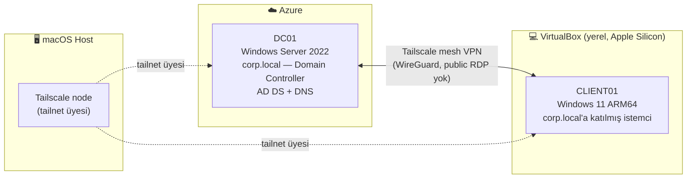
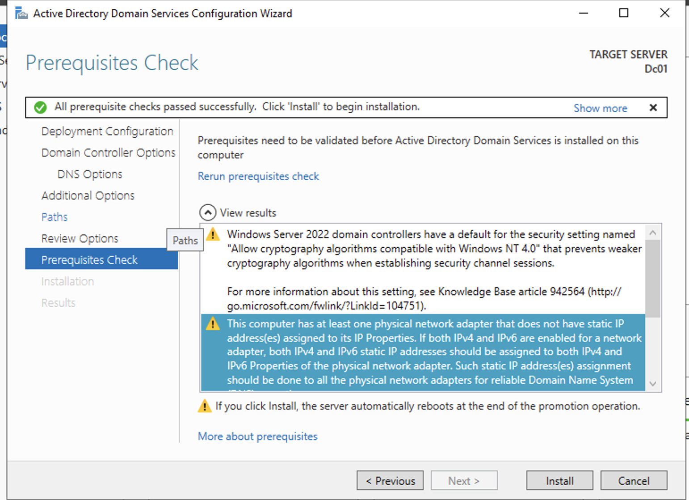
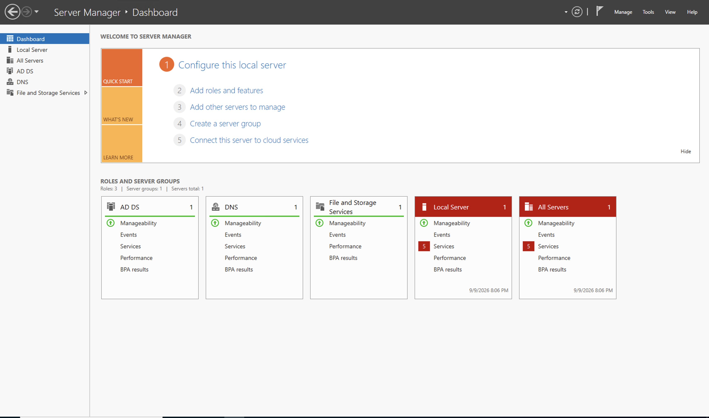
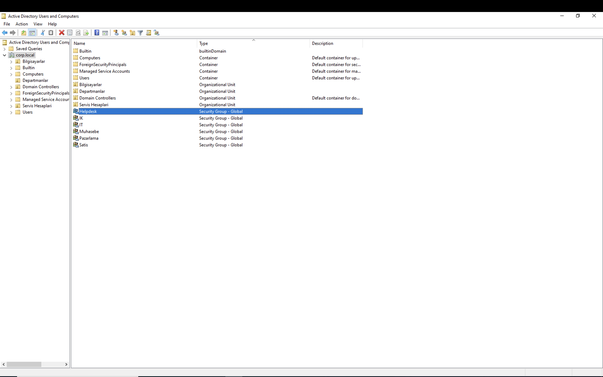
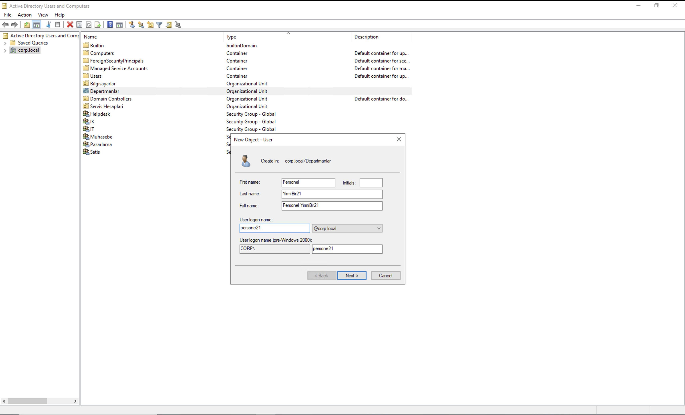
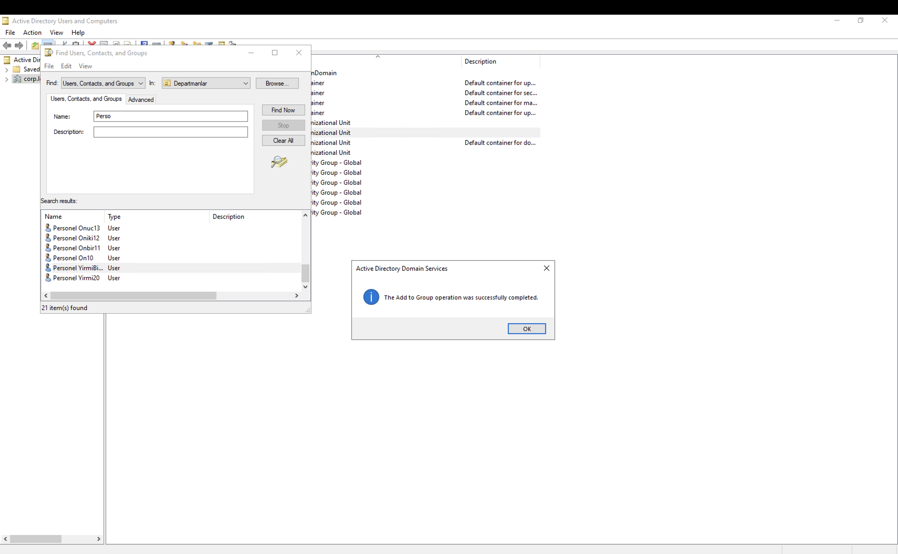
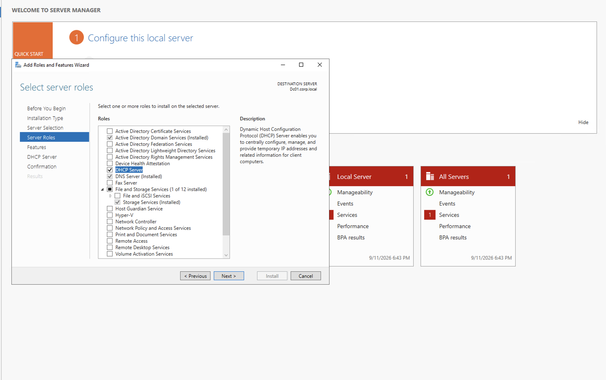
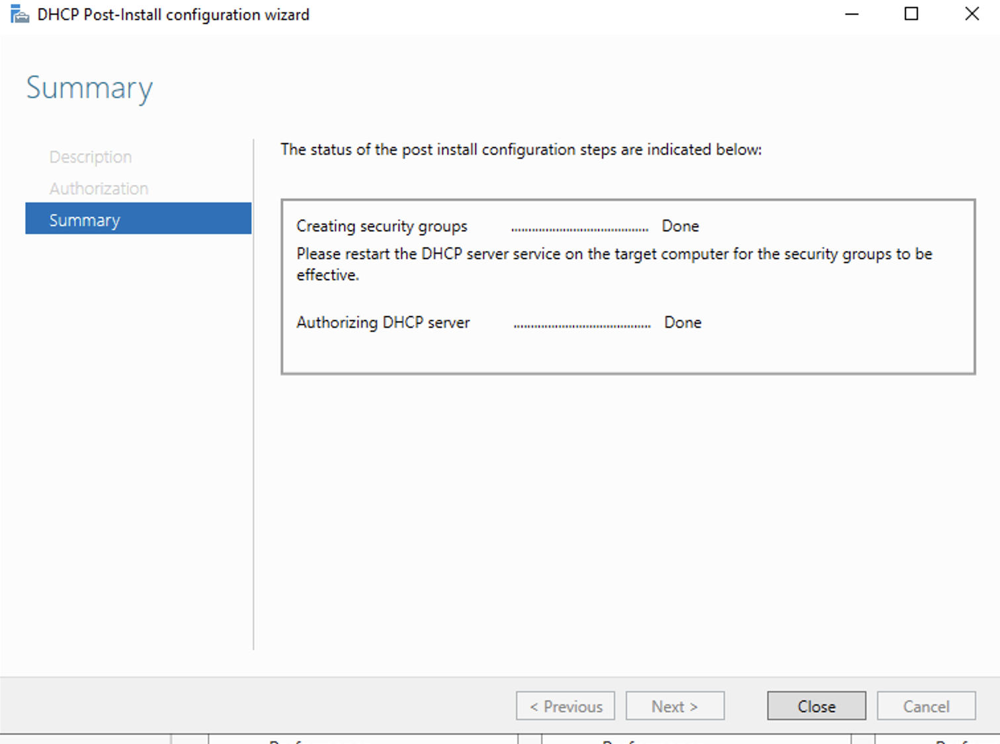
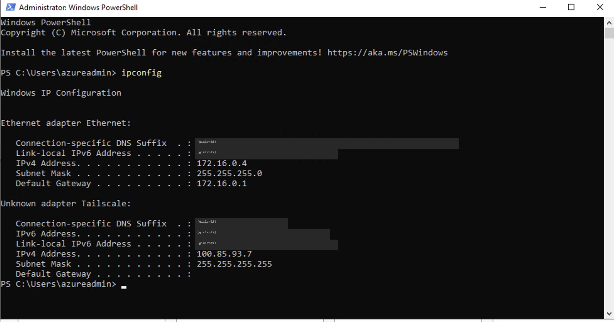
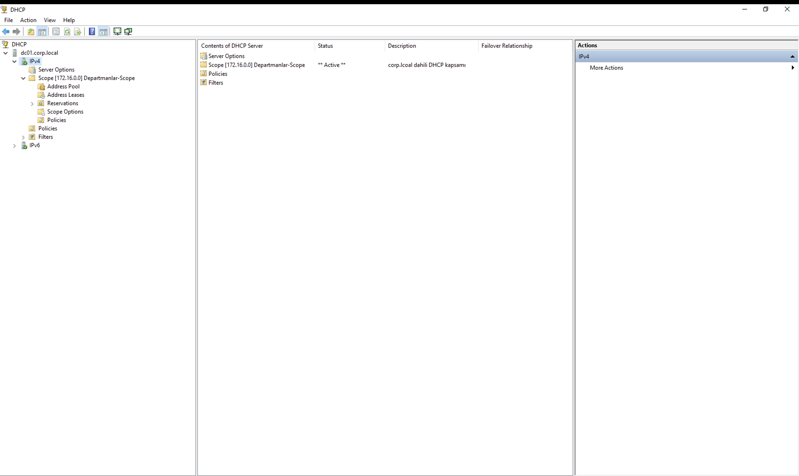

# Windows AD Helpdesk Lab

> **EN summary:** A hybrid Active Directory lab built to practice real IT helpdesk / sysadmin troubleshooting. A Domain Controller runs in Azure (Windows Server 2022), and a domain-joined Windows 11 client runs locally in VirtualBox on Apple Silicon — connected over a Tailscale mesh VPN instead of exposing RDP to the public internet. The most valuable part of this repo isn't that everything worked — it's [ERRORS.md](ERRORS.md): 9 real problems I hit, how I diagnosed each one, and what actually fixed it.

---

##  Bu lab ne kanıtlıyor?

Bu repo, gerçek bir BT destek / sistem yönetimi ortamının küçük ölçekli bir simülasyonu: bulutta bir domain controller, yerelde domain'e katılmış bir istemci, aralarında güvenli (public RDP'siz) bir bağlantı ve bunları kurarken karşılaşılan gerçek hataların adım adım kaydı.

Amaç, "her şey ilk seferde çalıştı" görüntüsü vermek değil — tam tersine, bir sorunla karşılaşınca **nasıl teşhis ettiğimi ve nasıl çözdüğümü** göstermek. Bu yüzden [`ERRORS.md`](ERRORS.md) dosyası bu reponun en önemli parçası.

## Mimari / Topoloji

**Neden bu mimari?** Apple Silicon Mac'lerde VirtualBox yalnızca native ARM64 misafir işletim sistemi çalıştırabiliyor (x86-64 emülasyonu yok), Windows Server'ın ise resmi ARM64 ISO'su yok. Bu yüzden sunucu tarafı Azure'a taşındı (x86-64 native), istemci tarafı yerelde ARM64 olarak kaldı. İkisi arasındaki bağlantı, public RDP portu açmak yerine Tailscale (WireGuard tabanlı mesh VPN) üzerinden kuruldu — gerçek kurumsal ortamlarda tercih edilen, daha güvenli bir yaklaşım.

## Kullanılan teknolojiler

| Bileşen | Detay |
|---|---|
| Domain Controller | Windows Server 2022 Datacenter, Azure (D2s_v6) |
| İstemci | Windows 11 ARM64, VirtualBox 7.2+ (yerel) |
| Dizin servisi | Active Directory Domain Services (AD DS), DNS Server |
| Adres dağıtımı | DHCP Server (172.16.0.0/24 kapsamı) |
| Ağ | Tailscale (WireGuard mesh VPN) — public RDP kapalı |
| Domain | `corp.local` |

## Ne yapıldı (özet)

1. Azure'da DC01 VM'i oluşturuldu, NSG ile erişim kısıtlandı
2. VirtualBox'ta CLIENT01 (Windows 11 ARM64) yerel olarak kuruldu
3. Her iki makineye Tailscale kurulup aynı tailnet'e bağlandı (Mac host dahil)
4. DC01'de AD DS rolü kuruldu, `corp.local` ormanı oluşturuldu, DC01 domain controller'a yükseltildi
5. CLIENT01, `corp.local` domain'ine katıldı ve `Test-ComputerSecureChannel -Verbose` ile kriptografik olarak doğrulandı (`True`)
6. Geçici RDP/NSG kuralları kaldırıldı, tüm erişim Tailscale üzerinden sağlandı
7. DC01'e DHCP Server rolü kuruldu, Active Directory'de yetkilendirildi ve 172.16.0.0/24 ağı için bir kapsam (scope) tanımlandı

## Kurulum 

**AD DS kurulum öncesi ön koşul kontrolü.** İki uyarı çıktı: biri Windows NT 4.0 uyumlu zayıf şifreleme algoritmalarının varsayılan olarak kapalı olduğunu söylüyor (bu iyi bir şey, dokunmadım), diğeri ağ arayüzünde sabit IP olmadığından şikâyet ediyor. İkincisi Azure'da beklenen bir uyarı — bulutta IP adresi işletim sistemi içinden değil, Azure NIC ayarlarından sabitleniyor.

**DC01 kurulum sonrası.** AD DS, DNS ve File and Storage Services rolleri ayakta; sunucu artık `corp.local` domain controller'ı.

**CLIENT01 domain katılımının doğrulanması.** Arayüzdeki "hoş geldiniz" mesajına güvenmek yerine güven ilişkisini komutla test ettim:

## Karşılaşılan hatalar

Kurulum sürecinde 9 ayrı gerçek hatayla karşılaştım — mimari uyumsuzluktan yanlış rol kurulumuna, yanlış yorumlanan arayüz mesajlarından, süreç boyunca not tutmak için kullandığım yapay zekâ asistanının kendi kendine yaptığı yanlış bir çıkarıma kadar. Hepsi ekran görüntüleriyle birlikte burada:

👉 **[ERRORS.md — Karşılaştığım Hatalar](ERRORS.md)**

En öğretici ikisi (7. ve 8.): ikisi de "sistem bana başarılı olduğunu söyledi ama aslında değildi" temasını paylaşıyor — biri notlarımı tutan yapay zekâ asistanının doğrulamadan yaptığı bir çıkarım, diğeri Windows'un kendisinin yanıltıcı bir arayüz mesajıydı. İkisinde de gerçek durumu ancak canlı sistemde doğrulayarak (`Get-ADDomain`, `Test-ComputerSecureChannel -Verbose`) teyit edebildim.

## OU, gruplar ve yetki devri

Lab ayakta olduktan sonra AD'yi biraz daha gerçekçi hale getirdim: bir OU ağacı (Departmanlar / Bilgisayarlar / Servis Hesapları), 5 departman grubu (IT, Satış, Muhasebe, İK, Pazarlama) ve bir Helpdesk grubu kurdum. Helpdesk grubuna Domain Admin yetkisi vermeden, sadece Departmanlar OU'sunda **parola sıfırlama** yetkisini devrettim (Delegation of Control Wizard) — gerçek bir helpdesk'in günlük işi genelde budur, Domain Admin olmadan bu işi yapabilmek.

20 kullanıcıyı toplu olarak PowerShell'le açtım (script ve CSV [powershell-itops-toolkit](https://github.com/erencatak/powershell-itops-toolkit) reposunda), 21. kişiyi ise bilerek GUI'den elle açtım :

Bu işin prosedürünü (yeni çalışan geldiğinde ne yapılıyor) [RUNBOOK-01-yeni-calisan.md](RUNBOOK-01-yeni-calisan.md) dosyasına yazdım — ilk hali, zamanla üstüne eklerim.

## DHCP — kullanıcı ağı için kapsam kurulumu

Buraya kadar hem DC01'in hem CLIENT01'in IP'si sabitti. Gerçek ortamlarda kullanıcı bilgisayarlarına IP'yi tek tek elle vermek yerine DHCP dağıtıyor, ben de DC01'e DHCP Server rolünü kurdum.

Kurulum biter bitmez Server Manager'da sarı bir uyarı çıktı: "Complete DHCP configuration". Bu adım, DHCP sunucusunu Active Directory'de yetkilendirmek (authorize) için. Domain ortamında yetkilendirilmemiş bir DHCP sunucusu istemcilere IP dağıtmıyor — AD, ağa izinsiz takılan sahte DHCP sunucularını böyle engelliyor. Yetkilendirmeyi yapıp DHCP servisini yeniden başlattım:

Kapsamı (scope) kurmadan önce sunucunun kendi ağına baktım. Burada dikkat ettiğim bir ayrıntı var: DC01'in iki arayüzü görünüyor. Azure'un Ethernet kartı 172.16.0.4, maskesi 255.255.255.0, gateway 172.16.0.1. Tailscale arayüzünün maskesi ise 255.255.255.255, yani nokta-nokta bir bağlantı — onun üstüne bir ağ kapsamı kurulamaz. Kapsamı bu yüzden Ethernet tarafındaki 172.16.0.0/24 ağı için oluşturdum.

Kapsam şöyle oldu: 172.16.0.100 – 172.16.0.200 aralığı, maske 255.255.255.0, gateway 172.16.0.1, DNS olarak DC01'in kendisi, kira süresi 8 gün (varsayılan). Sunucunun kendi adresi olan .4'ü ve baştaki adresleri bilerek aralığın dışında bıraktım — sabit IP'li cihazlara DHCP'nin dokunmaması gerekiyor.

Kapsamı istemci tarafında denemedim, çünkü bu lab'da CLIENT01 aynı yerel ağda değil — DC01'e Tailscale üzerinden bağlanıyor. DHCP istemcisi henüz IP'si olmadığı için sunucuyu yerel ağa attığı yayın (broadcast) mesajıyla arıyor, o mesaj da VPN'in diğer ucuna geçmiyor. Farklı ağdaki istemcilerin aynı DHCP sunucusundan adres alabilmesi için gerçek ortamlarda yönlendiricide DHCP Relay (`ip helper-address`) kullanılıyor.

## İletişim

Eren Çatak — [LinkedIn](https://www.linkedin.com/in/eren-%C3%A7atak-7539b5222)
