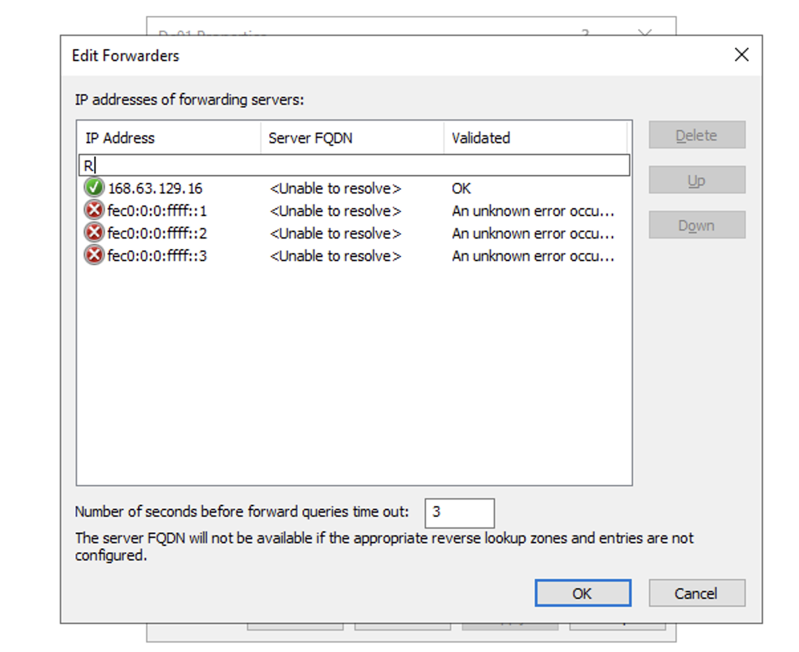
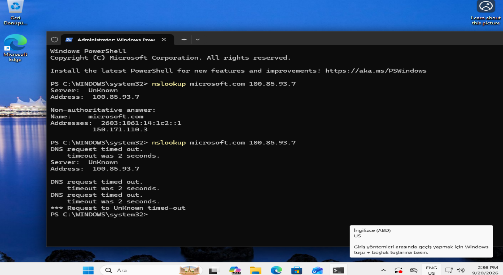
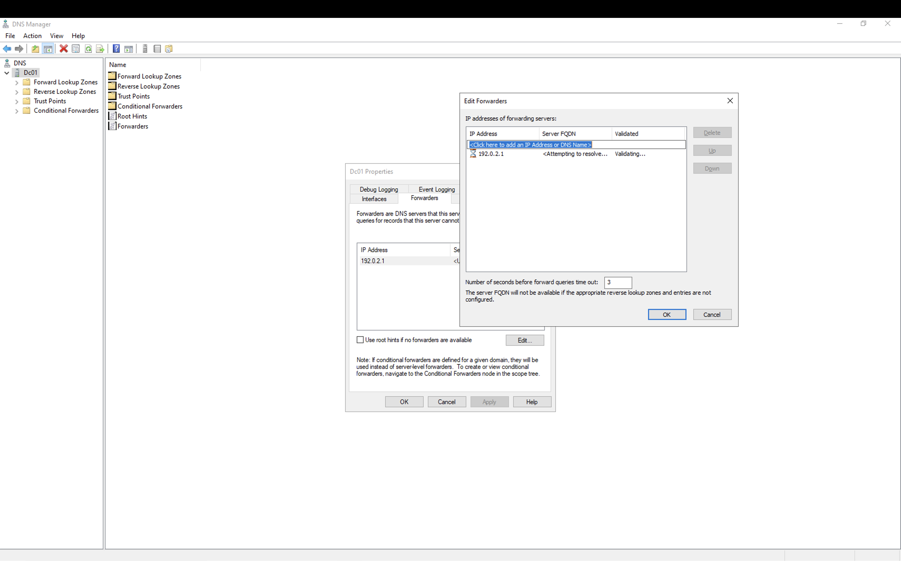
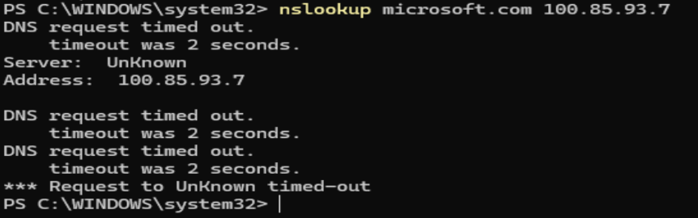
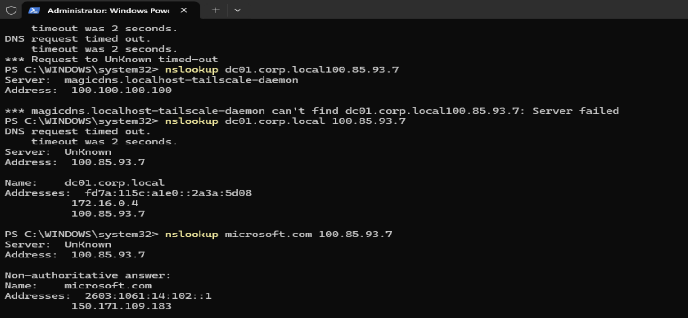

# Runbook #2 - Bilinçli Olarak DNS sorunlarının Teşhisi  

(ilk hali)

## Ne zaman Bakılmalı  ? 

Biri "sunucuya / paylaşıma erişemiyorum" ya da "internet açılmıyor, adres bulunamadı" dediğinde. Önce sorunun DNS olup olmadığına Bakılır.

## Önce 3 kontrol (istemci / Client tarafında )

1. `ipconfig /all` - DNS sunucusu kim? DC mi (100.85.93.7), yoksa 8.8.8.8 gibi başka bir şey mi?
2. İç isim: `nslookup dc01.corp.local 100.85.93.7`
3. Dış isim: `nslookup microsoft.com 100.85.93.7`

Sunucuyu (100.85.93.7) her seferinde açıkça yazmam gerekiyor . Yazmazsam CLIENT01'de nslookup varsayılan olarak Tailscale'in MagicDNS'ine (100.100.100.100) sorması beklenecek , DC'ye sormasını beklemeyiz değil. Bu yüzden çıktıdaki `Server:` satırına bakmamız gerekiyor .

Sonuca göre 3 yoldan biri:

## Durum A - iç isim de çözülmüyor

Belirti (DNS'i 8.8.8.8 yapınca): `dns.google can't find dc01.corp.local: Non-existent domain`. `Resolve-DnsName dc01.corp.local` da `DNS_ERROR_RCODE_NAME_ERROR` veriyor.

Sebep: istemcinin /Clientın DNS'i yanlış, DC'yi bulamıyor.

Çözüm:
1. `ncpa.cpl` > adaptör > Özellikler > IPv4 > Özellikler, DNS'i DC'ye (100.85.93.7) yönlendirmen gerekir . 
2. `ipconfig /flushdns`

## Durum B - iç çözülüyor, dış çözülmüyor ise 

Sebep: DC01'in forwarder ayarı.

Nereye bakıyorum: `dnsmgmt.msc` > DC01 sağ tık > Properties > Forwarders

- Adresler yeşil tikli mi? Azure 168.63.129.16'yı kendiliğinden ekliyor zaten bir değişiklik yapmanıza gerek yok . Fakat Azure kullanmıyorsanız eklemeniz gerekebilir . 
- Labda ulaşılamayan bir forwarder (192.0.2.1) yazıp "Use root hints if no forwarders are available" kutusunu kaldırınca dış isimler timeout verdi.
- Forwarder'ı tamamen silince de ilk denemede 2 saniyelik nslookup zaman aşımına düştü. Süreyi uzatınca (`nslookup -timeout=10 microsoft.com 100.85.93.7`) çözdü. Yani 2 saniyede cevap gelmemesi "bozuk" demek değildir yavaş da olabilir .


*Silmeden önce: Azure'un 168.63.129.16 adresi yeşil, fec0 satırları kırmızı ama zararsız.*


*Forwarder'lar silindikten sonra CLIENT01'de aynı sorgu 2 saniyede cevap alamadı (üstte silmeden önceki çalışan hali de görünüyor).*


*192.0.2.1 (ulaşılamayan bir adres) yazdım, "Use root hints" kutusu kapalı.*


*Bu haldeyken dış isim çözülmüyor.*

Çözüm:
1. Forwarder'ı doğru yaz (168.63.129.16), "Use root hints" kutusunu işaretle
2. DC01 sağ tık > Clear Cache

NOT : DC01'in kendi DNS'i kendisi (127.0.0.1). Testte dış çözümlemeyi bozarken Tailscale de kontrol sunucusunu bulamayabilir, bağlantı kopabilir. Kısa tut, hemen geri al. Kilitlenirsen Azure Portal > DC01 > Run command ile:
```powershell
Set-DnsServerForwarder -IPAddress 168.63.129.16 -UseRootHint $true
```
Yapman senin Forwarder'ı powershell'den değiştirmeni sağlayacaktır . 

## Durum C - DNS düzeldi ama erişim hâlâ tutarsız

Neden : DNS'i 8.8.8.8 yaptığım halde `\\dc01.corp.local\SYSVOL` açılmaya devam etti. Ya da DNS'i düzelttim, kullanıcı hâlâ şikayet ediyor.

Sebebi: DNS önbelleği ile SMB bağlantısı ayrı katmanların olması .  `ipconfig /flushdns` komutu açık olan SMB oturumunu temizlemiyor. Bağlantı zaten aktif ise zaten DNS'e tekrar sormuyor. O yüzden DNS önbelleğini temizlemiyor . Belki farklı yöntemler ile restart yapmadan çözülebilirdi ama klasik kapat aç yapmak daha garanti bir çözüm sunar diye düşündüm . 

Çözüm: bilgisayarı yeniden başlattım . Yeniden başlatınca (DNS 8.8.8.8 iken) SYSVOL erişimi kesildi.

## Takılacağımı düşündüğüm ama takılmadığım konular : 

- PTR kaydı otomatik gelmedi, elle ekledim (Reverse Lookup Zone > New Pointer)
- Server Manager'da DNS için 4015 / 4013 olayları açılışta çıkıyor, kendiliğinden geçiyor
- Forwarders listesinde `fec0:0:0:ffff::1/2/3` kırmızı X ile görünüyor, eski IPv6 adresleri, Windows'la geliyor, zararsız
- nslookup çıktısında `Server: UnKnown`, sunucunun PTR kaydı yok, normal

## Kontrol

Düzelttikten sonra:
```
nslookup dc01.corp.local 100.85.93.7
nslookup microsoft.com 100.85.93.7
```
İkisi de cevap vermeli.


*Üstteki hata, komutta boşluk unuttuğum için: nslookup varsayılan olarak MagicDNS'e sormuş. Altta doğru komutlarla `dc01.corp.local` ve `microsoft.com` cevap veriyor.*

---

